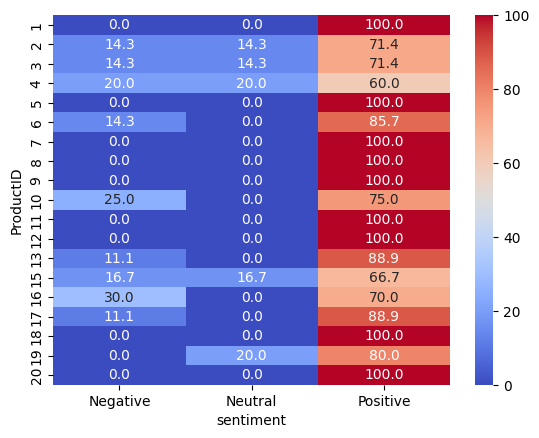

# Customer Behavior Analysis

## Table of Contents
- [Introduction](#introduction)
- [Problem Statement](#problem-Statement)
- [Project Structure](#project-structure)
- [Datasets](#datasets)
- [Model Name](#model-name)
- [Images](#images)
- [Prerequisites](#prerequisites)
- [Getting Started](#getting-started)
- [Installation Steps](#installation-steps)
- [How to Run the Project](#how-to-run-the-project)
- [Future Improvements](#future-improvements)

## Introduction
This project analyzes customer behavior using SQL and Python. The dataset consists of six CSV files, which have been cleaned and stored in a MySQL database using Python's MySQL Connector. The analysis includes SQL queries for data exploration, sentiment analysis, and visualization.

## Problem Statement
ShopEasy, an online retail business, is experiencing a decline in customer engagement and conversion rates, despite investing heavily in marketing campaigns. The company has observed:

- Reduced Customer Interactions: Fewer customers are engaging with the website and marketing content.
- Decreased Conversion Rates: A decline in the percentage of site visitors making purchases.
- High Marketing Expenses: Increased spending on digital marketing but without a proportional increase in revenue.
- Customer Feedback Gaps: Poorly understood customer preferences due to lack of structured feedback analysis.

To address these challenges, ShopEasy's Marketing and Customer Experience teams have reached out for a data-driven solution that analyzes customer behavior, reviews, and journey patterns using SQL and Python.
Understanding customer sentiment and behavior patterns to improve business decision-making using SQL-based data analysis and visualization.

## Project Structure
The repository is organized as follows:

Customer-Behavior-Analysis/
│── csv_files/          # Original 6 CSV files used for analysis
│── scripts/            # Python scripts for SQL connection, data processing, and analysis
│── notebooks/          # Jupyter Notebooks for exploratory analysis and visualization
│── results/            # Output reports, tables, and figures (if applicable)
│── images/             # Visualizations from sentiment analysis
│── README.md           # Project documentation
│── requirements.txt    # Dependencies for running the project

## Datasets
The dataset was provided by the Guvi Upskill platform as part of a data science certification project.

## Model Name
Sentiment analysis was conducted using TextBlob and VADER (NLTK).

## Images
### Visualizations

## Prerequisites
Ensure you have the following installed:
- Python 3+
- MySQL Server
- MySQL Connector for Python
- Required Python libraries (see requirements.txt)

## Getting Started
1. Clone the repository:
      git clone https://github.com/Balaji-itz-me/-customer_behavior_analysis.git
   cd Customer-Behavior-Analysis
   
2. Set up a virtual environment:
      python -m venv venv
   source venv/bin/activate  # macOS/Linux
   venv\Scripts\activate     # Windows
   
3. Install dependencies:
      pip install -r requirements.txt
   

## Installation Steps
1. Clone the repository:
       git clone https://github.com/Balaji-itz-me/-customer_behavior_analysis.git
   cd Customer-Behavior-Analysis
   
2. Install dependencies:
      pip install -r requirements.txt
   
3. Ensure MySQL is running and update database credentials if needed.

## How to Run the Project
Follow these steps to execute the project:

1. Ensure MySQL is Running and Set Up Database
   - Make sure MySQL is installed and running on your system.
   - Update the MySQL credentials in the script if required.

2. Run the Python Scripts
      python scripts/main.py
   

3. Explore Results
   - Jupyter Notebooks (notebooks/) can be used for further analysis and visualization.
   - Processed data and insights will be stored in the results/ folder.
  
## Future Improvements
Here are some possible future enhancements for this project:

- Enhancing Sentiment Analysis: Use advanced NLP models like BERT for better sentiment classification.
- More Advanced Visualizations: Create interactive dashboards with Plotly or Streamlit.
- Machine Learning Integration: Build models for customer segmentation and churn prediction.
- Automating the Workflow: Automate SQL queries and reports for real-time insights.

---
